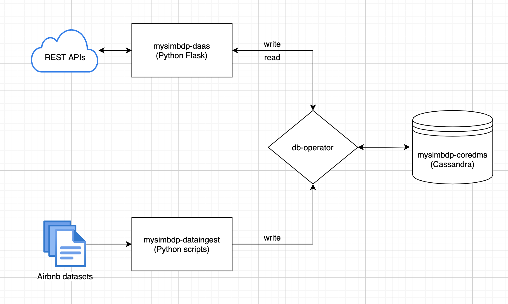
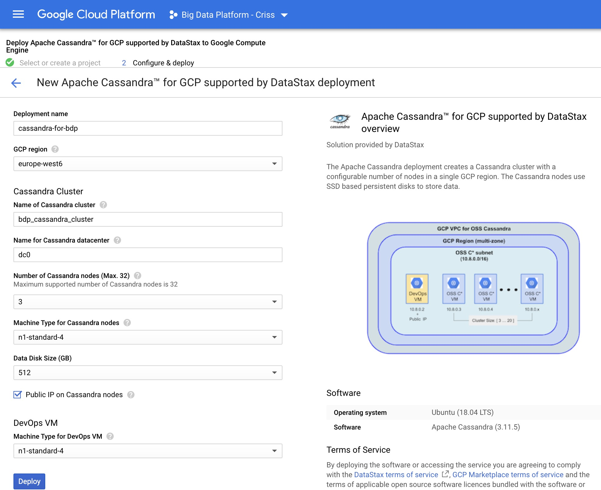
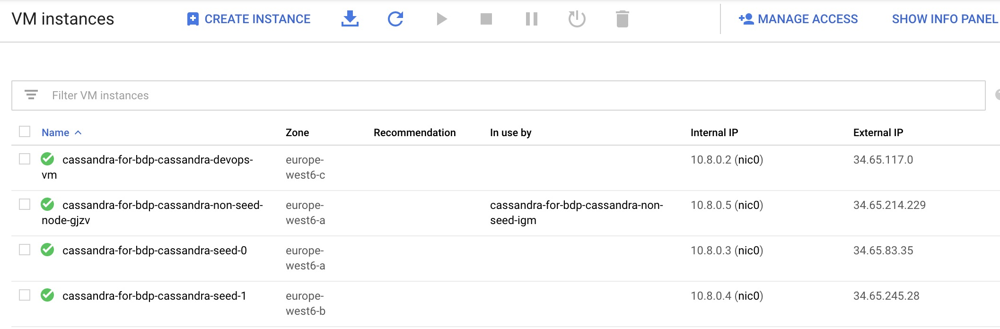
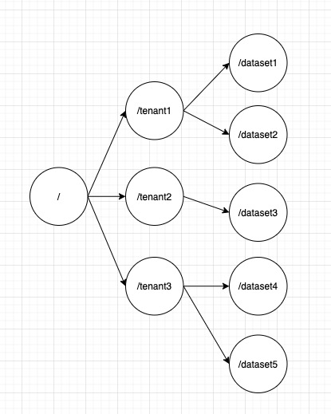
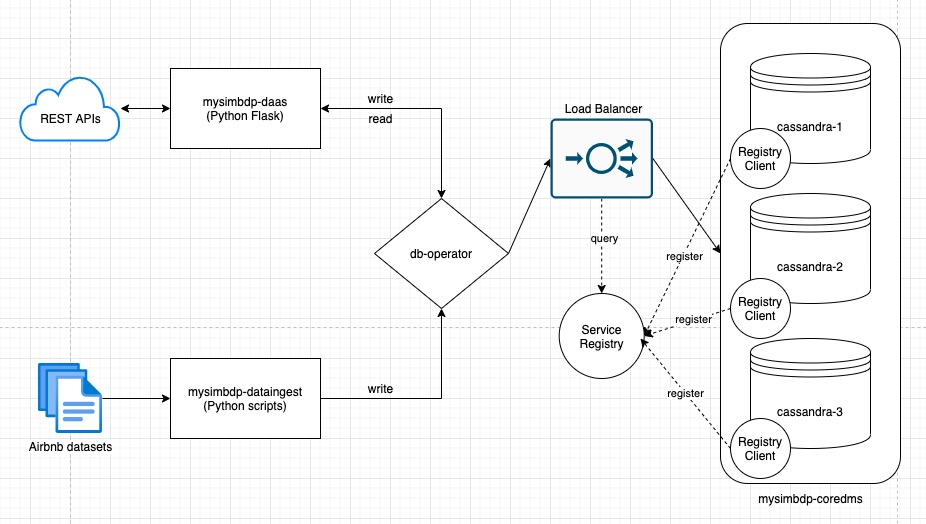

## Part 1 - Design
### 1. Explain your choice of data and technologies for mysimbdp-coredms (1 point)  
- Dataset: Airbnb (including listings.csv, calendar.csv, reviews.csv).  
- Techonology of mysimbdp-coredms: Cassandra.  
- Reason: Airbnb datasets are all structured text data. Intuitively a RDBMS would be chosen, but for the purpose of big data, dynamic query/search based on column data is more common, therefore a column-oriented database is more suitable.  
Among the technologies provided, HBase and Canssandra are both column-oriented database, so decision of using Cassandra is made under following considerations:
    1. HBase uses master/slave architecture, which has the problem of single point of failure (SPOF); Cassandra uses peer-to-peer architecture so it does not have the problem of SPOF.  
    2. HBase relies on the Hadoop ecosystem, it needs HDFS and Zookeeper to work together, which is more complex and difficult to configure and maintain; Cassandra it self is sufficient for data storage and data management, which is more convenient to use.
### 2. Design and explain interactions between main components in your architecture of mysimbdp (1 point)  

mysimbdp-coredms: A main component to store data. It is a Cassandra cluster.

db-operator: A component that directly interacts with mysimbdp-coredms, responsible for the action of writting and reading data.

mysimbdp-dataingest: A main component to read data from files and store into mysimbdp-coredms through db-operator.

mysimbdp-daas: A main component that exposes REST APIs to public for reading and storing data.  
### 3. Explain a configuration of a cluster of nodes for mysimbdp-coredms so that you do not have a single-point-of-failure problem for mysimbdp-coredms for your tenants (1 point)  
In this assignment, the Cassandra cluster is deployed on GCP using the [**Apache Cassandra™ for GCP supported by DataStax**](https://console.cloud.google.com/marketplace/product/datastax-public/cassandra-for-gcp?q=search&referrer=search&project=big-data-platform-criss). During configuration, 3 nodes are set:
  
As shown in the following picture, there are 3 Cassandra node vms and 1 DevOps vm:
  


### 4. You decide a pre-defined level of data replication for your tenants/customers. Explain how many nodes are needed in the deployment of mysimbdp-coredms for your choice so that this component can work property (e.g., the system still supports redundancy in the case of a failure of a node) (1 point)  
To prevent the situation of a node failure, intuitively at least two nodes are needed. However, according to some researches, a two-node cluster is more complex to set up correctly and manage than a three-node cluster. In a two-node cluster, it is more difficult for the cluster logic to determine what to do if there are communication (network) issues rather than a node failure.  

A minimum of three nodes can ensure that a cluster always has a quorum of nodes to maintain a healthy active cluster. Without it, it is impossible to reliably determine a course of action that both maximizes availability and prevents data corruption. Therefore, at least 3 nodes are needed for mysimbdp-coredms.  

Therefore, three nodes are configured in the deployment of mysimbdp-coredms.

### 5. Explain how would you scale mysimbdp to allow many tenants using mysimbdp-dataingest to push data into mysimbdp (1 point)  
For the mysimbdp-coredms, Cassandra already supports horizontal scaling out of the box, I would scale it as needed.  

For the mysimbdp-dataingest and mysimbdp-daas, they are deployed as docker containers, using ```docker-compose up --scale``` can horizontally scales the number of containers up or down according to needs, in that case a load balancer will be need using ```haproxy```.  

## Part 2 - Implementation  
### 1. Design, implement and explain the data schema/structure for mysimbdp-coredms (1 point)  
For Airbnb datasets, there are three types of files:  
- listings.csv:  
```sql
CREATE TABLE airbnb.listings (
    id bigint,
    listing_url text,
    scrape_id text,
    last_scraped date,
    name text,
    description text,
    neighborhood_overview text,
    picture_url text,
    host_id bigint,
    host_url text,
    host_name text,
    host_since date,
    host_location text,
    host_about text,
    latitude text,
    longitude text,
    property_type text,
    room_type text,
    accommodates int,
    bathrooms int,
    bathrooms_text int,
    bedrooms int,
    beds int,
    amenities text,
    price text,
    PRIMARY KEY (id, host_id)
);
```  
**listings** table stores all listings in Airbnb. There might be a scenario: querying all listings through a given ```host_id```. So the primary key is a composite key that includes ```id```, ```listing_id``` and ```reviewer_id```.  

- calendar.csv:  
```sql
CREATE TABLE airbnb.calendar (
    listing_id bigint,
    date date,
    available text,
    price text,
    adjusted_price text,
    minimum_nights int,
    maximum_nights int,
    PRIMARY KEY (listing_id, date)
);
```  
**calendar** table stores the status of listings (price, availability and bookable nights) on certain dates, so the primary key is a composite key that includes ```listing_id``` and ```date```.  

- reviews.csv:  
```sql
CREATE TABLE airbnb.reviews (
    listing_id bigint,
    id bigint,
    date date,
    reviewer_id bigint,
    reviewer_name text,
    comments text,
    PRIMARY KEY (id, listing_id, reviewer_id)
);
```  
**reviews** table stores reviews about a listing by a certain user. There might be a scenario: querying all reviews through a given ```listing_id```, or querying all reviews through a given ```reviewer_id```. So the primary key is a composite key that includes ```id```, ```listing_id``` and ```reviewer_id```.  

### 2. Design a strategy for data partitioning/sharding and explain your implementation for data partitioning/sharding together with your design for replication in Part 1, Point 4, in mysimbdp-coredms (1 point)  
In Cassandra, Primary Key = Partition Key + [Clustering Columns]. Cassandra uses partition key to determine which node store data on so that data partitioning is realized. The design of primary keys is stated in the previous question.  

For replication strategy, here **SimpleStrategy** is used with **Replication Factor** equals 3, such that three nodes of Cassandra cluster will keep a copy of every row of data. And as stated in Part 1, Point 4, the Cassandra cluster is configured with 3 nodes, that is to say, every node in this assignment will keep a replica of data.  

### 3. Write a mysimbdp-dataingest that takes data from your selected sources and stores the data into mysimbdp-coredms. Explain possible consistency options for writing data in your mysimdbp-dataingest (1 point)  
The code of mysimbdp-dataingest can be found in the file "dataingest.py" within the /code folder.  

In Cassandra, consistency level can be tuned depending on needs. For write operations, the consistency level specifies how many replica nodes must respond to the write operation to respond to the client that this is a successful write operation. A higher write consistency level may bring about a decrease in availability, because more nodes must respond to write operations to succeed.  

Possible consistency options for writing are as following:  
| Consistency levels | Descriptions                                                                                                            |
|--------------------|-------------------------------------------------------------------------------------------------------------------------|
| ANY                | Writes must be written to at least one node.                                                                            |
| ONE/TWO/THREE      | Writes must be written to the commit log and memtable of at least one/two/three node.                                   |
| LOCAL_ONE          | Writes must be sent to and successfully acknowledged by, at least one node in the local datacenter.                     |
| QUORUM             | Writes must be written to the commit log and memtable on a quorum of nodes across all data centers.                     |
| LOCAL_QUORUM       | Writes must be written to the commit log and memtable on a quorum of nodes in the same datacenter as the coordinator.   |
| EACH_QUORUM        | Writes must be written to the commit log and memtable on each quorum of nodes. Quorum is 51% of the nodes in a cluster. |
| ALL                | Writes must be written to the commit log and memtable on all in the cluster.                                            |

Here in this assignment, the write consistency level is set as "QUORUM" (sum_of_replication_factors / 2) + 1, which means 2 nodes should respond to every write operation.

### 4. Given your deployment environment, show the performance (response time and failure) of the tests for 1,5, 10, .., n of concurrent mysimbdp-dataingest writing data into mysimbdp-coredms with different speeds/velocities. Indicate any performance differences due to the choice of consistency options (1 point)  

### 5. Observing the performance and failure problems when you push a lot of data into mysimbdp-coredms (you do not need to worry about duplicated data in mysimbdp), propose the change of your deployment to avoid such problems (or explain why you do not have any problem with your deployment) (1 point)  


## Part 3 Extension
### 1. Using your mysimdbp-coredms, a single tenant can create many different databases/datasets. Assume that you want to support the tenant to manage metadata about the databases/datasets, what would be your solution? (1 point)  

### 2. Assume that each of your tenants/users will need a dedicated mysimbdp-coredms. Design the data schema of service information for mysimbdp-coredms that can be published into an existing registry (like ZooKeeper, consul or etcd) so that you can find information about which mysimbdp-coredms is for which tenants/users (1 point)  
 

### 3. Explain how you would change the implementation of mysimbdp-dataingest (in Part 2) to integrate a service discovery feature (no implementation is required) (1 point)  
Import a service registry (e.g. Zookeeper) and load balancer into the architecture, every node of cassandra cluster needs to register in the service registry, then client makes a request to a coredms service through a load balancer. The load balancer queries the service registry and routes each request to an available service instance. Now the architecture should kind of look like as following:
 

### 4. Assume that now only mysimbdp-daas can read and write data into mysimbdp-coredms, how would you change your mysimbdp-dataingest (in Part 2) to work with mysimbdp-daas? (1 point)  
I would shift mysimbdp-dataingest in front of mysimbdp-daas, create a API in mysimbdp-daas for mysimbdp-dataingest to call.  

### 5. Assume that you design APIs for mysimbdp-daas so that any other developer who wants to implement mysimbdp-dataingest can write his/her own ingestion program to write the data into mysimbdp-coredms by calling mysimbdp-daas. Explain how would you control the data volume and speed in writing and reading operations for a tenant? (1 point)  

